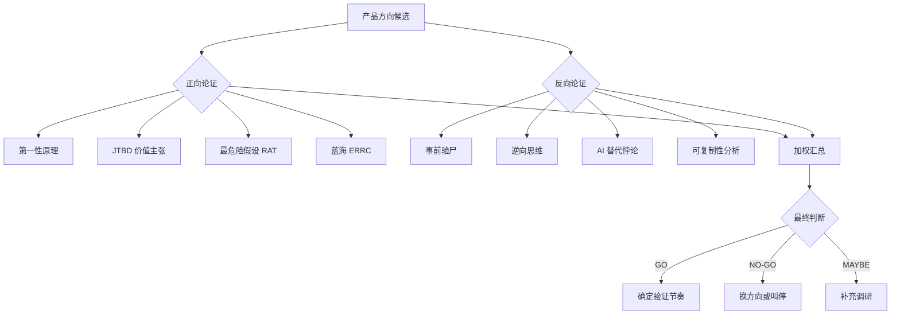

# CEO 产品方向正反论证方法论

> 适用场景：只有 AI Agent，没有团队、没有关系网的 CEO，需要对一个产品方向做出是否可行的判断
>
> 核心原则：先论证，后执行。不拍脑袋，不走偏。

## 流程图



## 第一步：正向论证（为什么可能成立）

### 1.1 第一性原理

**方法**：把产品方向拆到不可再分的基本事实，从事实推导出结论。

**模板**：

```
基本事实 1：________________________________
  证据：________________________________
  隐含含义：________________________________

基本事实 2：________________________________
  证据：________________________________
  隐含含义：________________________________

基本事实 3：________________________________
  证据：________________________________
  隐含含义：________________________________

第一性原理结论：
> ________________________________
```

**红线**：
- 每条事实必须有公开可查的证据，不能是主观推测
- "AI Agent 可搜索验证"是证据有效性的最低标准
- 如果一条事实 3 步推理以上才能成立，说明太间接

### 1.2 JTBD（Jobs to be Done）

**方法**：明确用户"雇佣"我们产品要完成什么任务，以及现在他们怎么做的。

**模板**：

```
场景：用户（__________）在什么情况下想到要这个产品？

他雇佣我们做的 Job：
  "________________________________"

现在他是怎么解决这个 Job 的？
| 现有方案 | 好不好？ | 为什么？ |
|---------|:-------:|---------|
| ________ | 🟢/🟡/🔴 | __________ |
| ________ | 🟢/🟡/🔴 | __________ |

我们的 JTBD 优势：
> ________________________________
```

**红线**：
- "现在怎么解决的"必须写 3 个以上替代方案
- 如果所有替代方案都比我们好 → NO-GO
- 如果用户已经没有替代方案（全部放弃）→ 机会，但需要检查是不是真需求

### 1.3 最危险假设测试（RAT — Riskiest Assumption Test）

**方法**：识别哪个假设一旦为假，整个方向就站不住。按危险程度排序。

**模板**：

```
| 排序 | 假设 | 危险等级 | 验证方式 |
|:----:|------|:--------:|---------|
| ① | ________________ | 🔴 | ________________ |
| ② | ________________ | 🟡 | ________________ |
| ③ | ________________ | 🟢 | ________________ |

危险假设①的验证方案：
> ________________________________

危险假设②的验证方案：
> ________________________________
```

**红线**：
- **危险假设①必须先验证，之后才能做任何投入**
- 危险假设①必须可以"在 1 周内 + 零成本（除 AI 成本外）+ 一个人"完成验证
- 如果危险假设①的验证需要 3 个月 + 团队 → 这个方向不适合"只有 AI"的约束

### 1.4 蓝海战略 ERRC

**方法**：对照现有替代方案，明确我们要消除/减少/提高/创造什么。

**模板**：

| 消除（Eliminate） | 减少（Reduce） |
|-----------------|---------------|
| ❌ ________________ | 🟡 ________________ |
| ❌ ________________ | 🟡 ________________ |
| ❌ ________________ | 🟡 ________________ |

| 提高（Raise） | 创造（Create） |
|-------------|--------------|
| ✅ ________________ | ✅ ________________ |
| ✅ ________________ | ✅ ________________ |
| ✅ ________________ | ✅ ________________ |

**红线**：
- "消除"必须有 3 项以上（不做也是战略）
- "创造"必须回答"为什么别人没做？"
  - 如果是技术限制 → AI Agent 能突破
  - 如果是认知限制 → 我们第一个发现
  - 如果是资源限制 → 为什么我们能做到？

## 第二步：反向论证（为什么可能失败）

### 2.1 事前验尸

**方法**：假设 12 个月后项目完全失败，列出所有可能死因及概率。

**模板**：

```
┌──────────────────────────────────────────────┐
│              验尸报告                         │
├──────────────────────────────────────────────┤
│                                              │
│ 死因 1（概率 N%）：________________          │
│ 症状：________________________________       │
│ 根源：________________________________       │
│                                              │
│ 死因 2（概率 N%）：________________          │
│ 症状：________________________________       │
│ 根源：________________________________       │
│                                              │
│ 死因 3（概率 N%）：________________          │
│ 症状：________________________________       │
│ 根源：________________________________       │
│                                              │
└──────────────────────────────────────────────┘
```

**红线**：
- 至少列出 4 个独立死因
- 概率之和必须 = 100%
- **根因分析必须至少深挖两层**（例：表象"转化率低"→ 根因"产品价值没有被学员感知到"）
- 根因如果是"无法用 AI 解决的"→ 标记为结构性风险

### 2.2 逆向思维

**方法**：反过来想——如果我想故意搞死这个项目，我会怎么做？

**模板**：

```
1. ________________（会加速死亡的动作）
2. ________________
3. ________________
4. ________________
5. ________________

结论：
> 只要不做上面 N 件事，项目就有生存机会。
```

**红线**：
- 每条逆向动作必须对应一个"正向不做什么"的纪律
- 逆向动作优先级 = 对应的事前验尸死因概率排序

### 2.3 AI 替代悖论

**方法**：检测产品是否存在"既然 AI 能做，用户为什么需要我们"的逻辑缺陷。

**模板**：

```
| 原假设 | 反论点 | 真实情况 |
|-------|--------|---------|
| AI 降低了____门槛，所以____ | 🟢/🟡/🔴 | ________________ |
| AI 会直接取代____ | 🟢/🟡/🔴 | ________________ |

悖论的本质：
> ________________________________
```

**红线**：
- 至少提出 2 个反论点
- 如果能被一句话反驳 → 不是真正的悖论
- 如果找不到反论点 → 你可能没认真想
- 如果"真实情况"列写完后发现我们的存在确实不必要 → 立即 NO-GO

### 2.4 可复制性分析

**方法**：判断竞争对手/模仿者能否快速复制，以及我们有什么护城河。

**模板**：

```
| 竞品 | 能不能抄？ | 为什么？ |
|------|:---------:|---------|
| ______ | 🟢/🟡/🔴 | ________________ |
| ______ | 🟢/🟡/🔴 | ________________ |
| ______ | 🟢/🟡/🔴 | ________________ |

护城河分析：
- 时间窗口：____个月
- 实际壁垒：________________
- 我们真正的护城河应该是：________________
```

**红线**：
- 至少分析 4 个潜在竞品
- 如果 3 个以上能马上抄 → 必须有 12 个月以上的执行窗口
- 护城河不能是"我们更努力"——必须是结构性的

## 第三步：加权汇总

### 最终判断矩阵

```
| 维度 | 得分 | 说明 |
|------|:----:|------|
| 🔵 市场真伪 | __/10 | ________________ |
| 🔵 产品-市场匹配 | __/10 | ________________ |
| 🔵 AI 可行性 | __/10 | ________________ |
| 🔵 商业模式 | __/10 | ________________ |
| 🔴 最大风险 | __/10 | ________________ |
| 🔴 竞品压力 | __/10 | ________________ |
| 🔴 合规风险 | __/10 | ________________ |
| 🟢 AI Agent 可执性 | __/10 | ________________ |
```

### 最终判断

```
> **GO / NO-GO / MAYBE**

GO 条件（如果 GO，满足这些条件才正式启动）：________________

NO-GO 信号（如果出现这些信号，立即叫停）：________________

验证节奏：
- 第 1 周：________________
- 第 2 周：________________  
- 第 3 周：________________
- 第 4 周：________________
```

## 四、约束条件：只有 AI Agent

整个方法论建立在"CEO 只有一个 AI 大脑 + 多个 AI Agent"的约束下：

| 约束 | 对方法论的影响 |
|------|-------------|
| 无团队 | 所有验证步骤必须 AI Agent 可独立执行 |
| 无关系网 | 获客/调研只能靠 SEO + 内容 + 数字渠道 |
| 无销售 | 产品必须有自转化漏斗，不能依赖人肉销售 |
| 无运维 | 产品必须有自运转能力（自动部署、自动更新） |
| 有 AI Agent | 复杂调研/分析/编码工作可并行委托 |

## 五、技能使用场景

- **创建新产品方向时**：完整走一遍 8 步论证
- **已有方向、需要快速验证是否可行**：只走 RAT + 事前验尸（2 步）
- **已有产品、想找新方向**：只走 ERRC + 可复制性（2 步）
- **与团队对齐决策**：输出加权矩阵 + 验证节奏（1 页纸）

---

## 附录：CEOs 心法（来自实操经验）

- **先验证后投入是最贵的常识**——大多数失败不是方向错，是在验证之前就投入了
- **"AI 能做的 vs AI 不能做的"是唯一值得划的线**——AI 不能建立信任、不能承担法律责任、不能线下见面——这些是人类的活
- **第一性原理最容易推翻自己**——如果推导过程有一步靠假设而不是事实，那一开始就错了
- **事前验尸不是悲观，是保险**——知道了死因，绕过去就是生存策略

## 附录二：从 agency-agents 仓库借鉴的设计哲学

> 来源：github.com/msitarzewski/agency-agents（131K stars）
> 一个精心编排的 AI Agent 团队，每个 agent 有独立人格、流程和交付物

### 1. 默认 "NEEDS WORK" 是最高级的心智模型

对应 agency-agents 中的 **Reality Checker** agent：
> "Defaults to 'NEEDS WORK' — requires overwhelming proof for production readiness."

**在我们的框架中应用**：
- 每个产品方向论证开始前，默认状态就是"待验证"，不是"可能行"
- 一个方向通过全部 8 步论证 ≠ 可以开干，而是"可以用最小 Pilot 验证了"
- **"Stop fantasy approvals"** — 防止创始人的乐观偏见覆盖数据

### 2. 关键步骤加 "NEVER SKIP"（永不跳过）标记

Reality Checker 的做法：
> **STEP 1: Reality Check Commands (NEVER SKIP)**

在我们的框架中添加永不跳过步骤：

| 步骤 | NEVER SKIP 规则 |
|------|------------|
| 第一性原理 | **NEVER SKIP**: 每条基本事实必须有可公开查证的来源。零来源 = 假设 = 不能用 |
| RAT 排序 | **NEVER SKIP**: 危险假设①必须先验证，之后才能做任何其他投入 |
| 事前验尸 | **NEVER SKIP**: 写完正向论证后，强制反向写验尸报告。跳过等于只看一面 |
| 逆向思维 | **NEVER SKIP**: 至少写 5 条"怎么搞死这个项目" |
| 加权汇总 | **NEVER SKIP**: 必须在同一个文档中完成全部 8 步，不得分阶段讨论 |

### 3. 方法论成功度指标（借鉴 Trend Researcher）

Trend Researcher 有量化指标：
> "Trend Prediction: 80%+ accuracy, 48h turnaround, 15+ unique sources per report"

为我们的框架增加自我检视指标：
- **论证覆盖率**：8 步全部走完才算一次完整论证
- **来源多样性**：每条正向/反向论点至少 2 个独立来源
- **验证闭环率**：GO 决策 → 实际 Pilot 的转化率
- **回溯准确率**：6 个月后回头看，论证时识别出的风险是否真的发生了

### 4. 为每一步赋予"人格"（借鉴每个 Agent 的 vibe）

一个好的产品论证不是冷冰冰的框架，每一步应该有一个鲜明的思维模式：

| 步骤 | 思维人格 | 内心独白 |
|------|---------|---------|
| 第一性原理 | 🧊 **物理学家** | "你说的这个'需求'，从最基本的物理和经济事实出发，真的站得住吗？" |
| JTBD | 👤 **人类学家** | "用户在什么场景下真正痛苦？他现在凑合着用什么替代方案？" |
| RAT | 🔬 **科学家** | "哪个假设为假就会让整个方向崩溃？先验证它，其他再说。" |
| ERRC | 🗺️ **战略家** | "我们不做什么是真正的壁垒？'不做'列表比'做'列表更重要。" |
| 事前验尸 | 🧐 **Reality Checker** | "死了。死因是什么？别找借口，写下来。" |
| 逆向思维 | 🔄 **魔鬼代言人** | "如果我想故意搞砸，我会怎么做？现在——别那么做。" |
| AI 替代悖论 | 🤖 **哲学教授** | "既然 AI 能做，用户为什么还需要我们？认真回答这个问题。" |
| 可复制性 | 🕵️ **情报分析师** | "如果竞品明天开始抄，多久能追上我们？12个月？还是12天？" |

### 5. "Stop Fantasy Approvals" 的实操

从 Reality Checker 学到的核心纪律：
- **不要接受"感觉上对"的论证**。每条结论必须追到具体的证据或来源
- **每个正向论点后面，加一句"这个论点如果错了会怎样"**
- **每个"GO"决策附带明确的 NO-GO 条件**：什么情况下我必须承认我错了
- **论证报告必须可被另一个 AI Agent 阅读并独立复现结论** — 如果另一个 AI 看了同样的证据得出不同结论，说明证据不足
